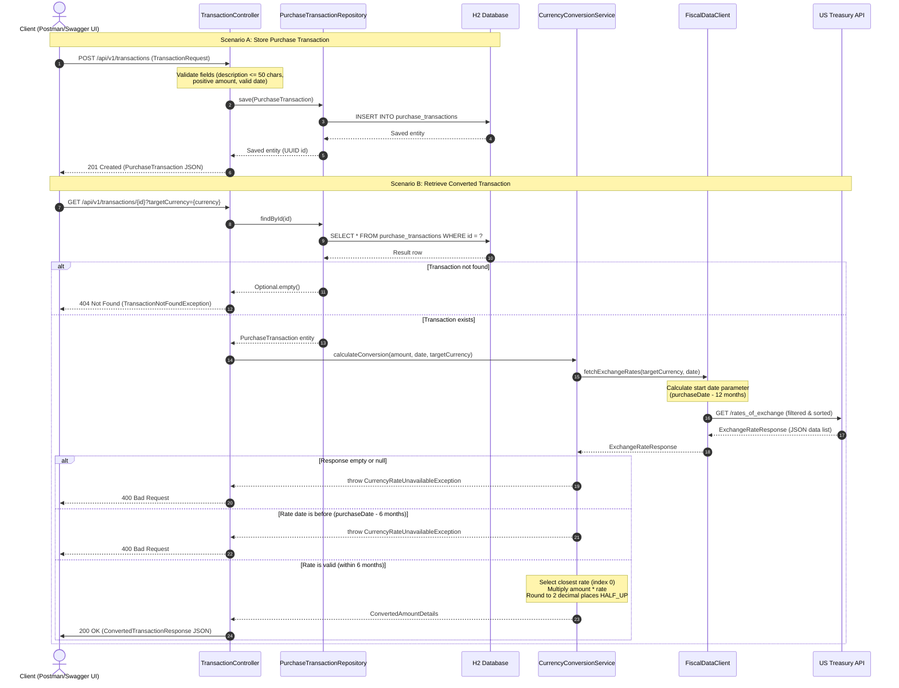

# Corporate Transactions & Multi-Currency Conversion Service

A production-ready, highly portable Spring Boot 3.x microservice built to ingest, persist, and retrieve corporate purchase transactions with automated multi-currency conversion capabilities powered by the US Treasury Reporting Rates of Exchange API.

---

## 🏛️ Architectural Highlights & Design DNA

This service was designed from the ground up using clean architecture and domain-driven design patterns, prioritizing financial precision, high performance, and robust error safety:

* **Financial Precision-First:** To prevent floating-point rounding issues common to binary representations (`double` or `float`), all transaction amounts and currency exchange operations strictly utilize `java.math.BigDecimal` with explicit scale alignments (`2` decimal places) and clean `RoundingMode.HALF_UP` configurations.
* **Separation of Concerns:** Implements a clean Controller-Service-Client architecture:
    * `controller`: Encapsulates REST API ingress boundaries, Swagger/OpenAPI exposure, request validation, and global HTTP exception mappings.
    * `service`: Houses core business rule validation (such as enforcing the 6-month historical rate boundary constraint).
    * `client`: Abstracts downstream gateway calls using Spring Boot 3's modern, fluent `RestClient`.
* **API Gateway Throughput Optimization:** Rather than downloading large multi-megabyte historical XML/JSON lists from the federal gateway, the `FiscalDataClient` applies aggressive server-side filtering (`?filter=...`) to download *only* the specific data bracket needed for the target currency and transaction window.
* **Zero-Dependency Portability:** Uses an embedded, in-memory H2 database managed via Spring Data JPA. The application requires zero local database setups, external credentials, or container provisioning to run out of the box.

---

## 🔄 End-to-End Execution Flow

The sequence diagram below details the data flow and boundary validations for storing a transaction and querying it with historical multi-currency conversions:



---

## 🛠️ Prerequisites & Local Environment

* **Java:** JDK 17 or 21
* **Build Tool:** Maven (Wrapper included in repository)

---

## 🚀 Getting Started (Build & Run)

To build the application, execute the comprehensive test suite, and launch the server locally on port `8080`, run the following commands:

```bash
# Build the project and execute the unit and integration test suite
./mvnw clean test

# Launch the microservice application locally
./mvnw spring-boot:run
```

Once started:
* **Interactive UI Playground:** Access the Swagger UI dashboard at [http://localhost:8080/swagger-ui/index.html](http://localhost:8080/swagger-ui/index.html) to interact with and test all endpoint requests directly.
* **OpenAPI Specs:** View the generated raw JSON OpenAPI specifications at [http://localhost:8080/v3/api-docs](http://localhost:8080/v3/api-docs).
* **Database Console:** Access the H2 in-memory database explorer at [http://localhost:8080/h2-console](http://localhost:8080/h2-console) (JDBC URL: `jdbc:h2:mem:transactionsdb`, Username: `sa`, Password: `[blank]`).

---

## 🧪 Testing Scope & Coverage (Jacoco)

The test suite covers REST endpoint integrations, domain services, client mock integrations, and structural DTOs. 

To run tests and check the coverage percentage:
```bash
./mvnw clean test
```
The test coverage reports are automatically generated by the Jacoco plugin and can be opened locally at:
`target/site/jacoco/index.html`

### Current Metrics
* **Total Instruction Coverage:** **98%**
* **Total Branch Coverage:** **91%**

| Package | Instruction Cov. | Branch Cov. | Targeted Component Verification |
| :--- | :---: | :---: | :--- |
| `controller` | **100%** | n/a | REST API boundaries, validation filters, exception mappings |
| `client` | **100%** | n/a | Downstream query construction & network gateway mock servers |
| `service` | **100%** | **87%** | Precision calculations & 6-month threshold validation rules |
| `model` | **100%** | **100%** | Entity model constructs and scale alignments |
| `dto` | **100%** | n/a | Request and Response JSON serialization mappings |
| `exception` | **100%** | n/a | Business validation exceptions |