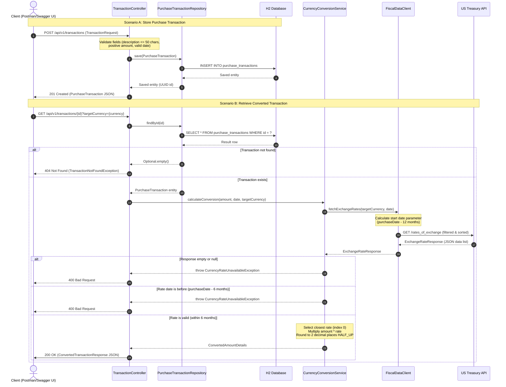

# Corporate Transactions & Multi-Currency Conversion Service

A production-ready, highly portable Spring Boot 3.x microservice built to ingest, persist, and retrieve corporate purchase transactions with automated multi-currency conversion capabilities powered by the US Treasury Reporting Rates of Exchange API.

---

## 📋 Table of Contents
1. [Requirements Mapping](#-requirements-mapping)
2. [Architectural Highlights & Design DNA](#️-architectural-highlights--design-dna)
3. [End-to-End Execution Flow](#-end-to-end-execution-flow)
4. [Component & Code Walkthrough](#-component--code-walkthrough)
5. [Prerequisites & Local Environment](#️-prerequisites--local-environment)
6. [Getting Started (Build & Run)](#-getting-started-build--run)
7. [Testing Scope & Coverage (Jacoco)](#-testing-scope--coverage-jacoco)
8. [Interview Demo Playbook](#-interview-demo-playbook)

---

## 📋 Requirements Mapping

This microservice satisfies the business requirements with the following architectural components:

### Requirement #1: Store a Purchase Transaction
* **Rule:** Accept and store a purchase transaction with a description (max 50 chars), transaction date, and positive USD amount (rounded to the nearest cent). Assign a unique UUID identifier.
* **Implementation:** 
  * **HTTP Endpoint:** `POST /api/v1/transactions` mapped in [TransactionController.java](src/main/java/com/wex/corporatepayments/controller/TransactionController.java).
  * **Validation:** Enforced using Spring Validation (`@Valid` with `@Size`, `@NotNull`, and `@DecimalMin` annotations) in [TransactionRequest.java](src/main/java/com/wex/corporatepayments/dto/TransactionRequest.java) and [PurchaseTransaction.java](src/main/java/com/wex/corporatepayments/model/PurchaseTransaction.java).
  * **Persistence:** Saved automatically to an embedded H2 database using Spring Data JPA.

### Requirement #2: Retrieve & Convert to Target Currency
* **Rule:** Retrieve a transaction converted to a target currency using the [US Treasury Reporting Rates of Exchange API](https://fiscaldata.treasury.gov/datasets/treasury-reporting-rates-exchange/treasury-reporting-rates-of-exchange) based upon the exchange rate active for the date of the purchase (or the closest preceding exchange rate, up to a maximum historical limit of 6 months). If no rate exists within this 6-month window, return an error. Round converted amounts to 2 decimal places.
* **Implementation:**
  * **HTTP Endpoint:** `GET /api/v1/transactions/{id}?targetCurrency={currency}` mapped in [TransactionController.java](src/main/java/com/wex/corporatepayments/controller/TransactionController.java).
  * **API Client:** [FiscalDataClient.java](src/main/java/com/wex/corporatepayments/client/FiscalDataClient.java) queries the US Treasury API with dynamically calculated start date parameters and server-side filtering.
  * **Domain Validation:** [CurrencyConversionService.java](src/main/java/com/wex/corporatepayments/service/CurrencyConversionService.java) evaluates the 6-month threshold limit and performs the multi-currency calculation using `BigDecimal` scale alignments.

---

## 🏛️ Architectural Highlights & Design DNA

* **Financial Precision-First:** To prevent floating-point rounding issues common to binary representations (`double` or `float`), all transaction amounts and currency exchange operations strictly utilize `java.math.BigDecimal` with explicit scale alignments (`2` decimal places) and clean `RoundingMode.HALF_UP` configurations.
* **Separation of Concerns:** Implements a clean Controller-Service-Client architecture:
    * `controller`: Encapsulates REST API ingress boundaries, Swagger/OpenAPI exposure, request validation, and global HTTP exception mappings.
    * `service`: Houses core business rule validation (such as enforcing the 6-month historical rate boundary constraint).
    * `client`: Abstracts downstream gateway calls using Spring Boot 3's modern, fluent `RestClient`.
* **API Gateway Throughput Optimization:** Rather than downloading large multi-megabyte historical XML/JSON lists from the federal gateway, the `FiscalDataClient` applies server-side filtering (`?filter=...`) to download *only* the specific data bracket needed for the target currency and transaction window.
* **Zero-Dependency Portability:** Uses an embedded, in-memory H2 database managed via Spring Data JPA. The application requires zero local database setups, external credentials, or container provisioning to run out of the box.

---

## 🔄 End-to-End Execution Flow

The sequence diagram below details the data flow and boundary validations for storing a transaction and querying it with historical multi-currency conversions:


```mermaid
sequenceDiagram
    autonumber
    actor User as Client (Postman/Swagger UI)
    participant Ctrl as TransactionController
    participant Repo as PurchaseTransactionRepository
    participant DB as H2 Database
    participant Service as CurrencyConversionService
    participant Client as FiscalDataClient
    participant Treasury as US Treasury API

    %% POST Flow
    Note over User, DB: Scenario A: Store Purchase Transaction
    User->>Ctrl: POST /api/v1/transactions (TransactionRequest)
    Note over Ctrl: Validate fields (description <= 50 chars,<br/>positive amount, valid date)
    Ctrl->>Repo: save(PurchaseTransaction)
    Repo->>DB: INSERT INTO purchase_transactions
    DB-->>Repo: Saved entity
    Repo-->>Ctrl: Saved entity (UUID id)
    Ctrl-->>User: 201 Created (PurchaseTransaction JSON)

    %% GET Flow
    Note over User, Treasury: Scenario B: Retrieve Converted Transaction
    User->>Ctrl: GET /api/v1/transactions/{id}?targetCurrency={currency}
    Ctrl->>Repo: findById(id)
    Repo->>DB: SELECT * FROM purchase_transactions WHERE id = ?
    DB-->>Repo: Result row
    alt Transaction not found
        Repo-->>Ctrl: Optional.empty()
        Ctrl-->>User: 404 Not Found (TransactionNotFoundException)
    else Transaction exists
        Repo-->>Ctrl: PurchaseTransaction entity
        Ctrl->>Service: calculateConversion(amount, date, targetCurrency)
        Service->>Client: fetchExchangeRates(targetCurrency, date)
        Note over Client: Calculate start date parameter<br/>(purchaseDate - 12 months)
        Client->>Treasury: GET /rates_of_exchange (filtered & sorted)
        Treasury-->>Client: ExchangeRateResponse (JSON data list)
        Client-->>Service: ExchangeRateResponse
        alt Response empty or null
            Service-->>Ctrl: throw CurrencyRateUnavailableException
            Ctrl-->>User: 400 Bad Request
        else Rate date is before (purchaseDate - 6 months)
            Service-->>Ctrl: throw CurrencyRateUnavailableException
            Ctrl-->>User: 400 Bad Request
        else Rate is valid (within 6 months)
            Note over Service: Select closest rate (index 0)<br/>Multiply amount * rate<br/>Round to 2 decimal places HALF_UP
            Service-->>Ctrl: ConvertedAmountDetails
            Ctrl->>User: 200 OK (ConvertedTransactionResponse JSON)
        end
    end
```

---

## 🔍 Component & Code Walkthrough

### 1. Persistent Domain Model
* **File:** [PurchaseTransaction.java](src/main/java/com/wex/corporatepayments/model/PurchaseTransaction.java)
* **Design Decision:** Utilizes `@GeneratedValue(strategy = GenerationType.UUID)` to guarantee universally unique identifier assignments. The constructor maps incoming parameters and applies `setScale(2, HALF_UP)` defensively on initialization to ensure financial database integrity from the start.

### 2. Controller & REST Boundary
* **File:** [TransactionController.java](src/main/java/com/wex/corporatepayments/controller/TransactionController.java)
* **Design Decision:** Leverages standard `@RestController` patterns. Maps errors cleanly (like 404s and validation problems) to custom exceptions handled globally by [GlobalExceptionHandler.java](src/main/java/com/wex/corporatepayments/controller/GlobalExceptionHandler.java) returning descriptive error payloads.

### 3. Downstream API Client
* **File:** [FiscalDataClient.java](src/main/java/com/wex/corporatepayments/client/FiscalDataClient.java)
* **Design Decision:** Instead of pulling all records, this client queries a 12-month historical window:
  ```java
  LocalDate calculationBufferStart = purchaseDate.minusMonths(12);
  ```
  It queries the US Treasury endpoint with server-side filters sorted descending by date (`sort=-record_date`), restricting page sizes to optimize performance.

### 4. Calculation Service
* **File:** [CurrencyConversionService.java](src/main/java/com/wex/corporatepayments/service/CurrencyConversionService.java)
* **Design Decision:** Validates whether the fetched rate falls within the strict 6-month historical limit relative to the purchase date:
  ```java
  if (rateDate.isBefore(purchaseDate.minusMonths(6))) {
      throw new CurrencyRateUnavailableException("No currency conversion rate is available within 6 months...");
  }
  ```
  Applies exact math conversion on the rate using `BigDecimal.multiply(...)` and rounds cleanly.

---

## 🛠️ Prerequisites & Local Environment

* **Java:** JDK 17 or 21
* **Build Tool:** Maven (Wrapper included in repository)

---

## 🚀 Getting Started (Build & Run)

To build the application, execute the comprehensive test suite, and launch the server locally on port `8080`, run the following commands:

```bash
# Build the project and execute the unit and integration test suite
./mvnw clean test

# Launch the microservice application locally
./mvnw spring-boot:run
```

Once started:
* **Interactive UI Playground:** Access the Swagger UI dashboard at [http://localhost:8080/swagger-ui/index.html](http://localhost:8080/swagger-ui/index.html) to interact with and test all endpoint requests directly.
* **OpenAPI Specs:** View the generated raw JSON OpenAPI specifications at [http://localhost:8080/v3/api-docs](http://localhost:8080/v3/api-docs).
* **Database Console:** Access the H2 in-memory database explorer at [http://localhost:8080/h2-console](http://localhost:8080/h2-console) (JDBC URL: `jdbc:h2:mem:transactionsdb`, Username: `sa`, Password: `[blank]`).
* **US Treasury Rates API Documentation:** View reference materials and details at [Treasury Reporting Rates of Exchange dataset API](https://fiscaldata.treasury.gov/datasets/treasury-reporting-rates-exchange/treasury-reporting-rates-of-exchange).

---

## 🧪 Testing Scope & Coverage (Jacoco)

The test suite covers REST endpoint integrations, domain services, client mock integrations, and structural DTOs. 

To run tests and check the coverage percentage:
```bash
./mvnw clean test
```
The test coverage reports are automatically generated by the Jacoco plugin and can be opened locally at:
`target/site/jacoco/index.html`

### Current Metrics
* **Total Instruction Coverage:** **98%**
* **Total Branch Coverage:** **91%**

| Package | Instruction Cov. | Branch Cov. | Targeted Component Verification |
| :--- | :---: | :---: | :--- |
| `controller` | **100%** | n/a | REST API boundaries, validation filters, exception mappings |
| `client` | **100%** | n/a | Downstream query construction & network gateway mock servers |
| `service` | **100%** | **87%** | Precision calculations & 6-month threshold validation rules |
| `model` | **100%** | **100%** | Entity model constructs and scale alignments |
| `dto` | **100%** | n/a | Request and Response JSON serialization mappings |
| `exception` | **100%** | n/a | Business validation exceptions |

---

## 🎯 Interview Demo Playbook

During the interview, run through this script to present your microservice:

### Step 1: Initialize a USD Transaction
Use the Swagger UI page or run a `curl` request to store a new USD transaction:
```bash
curl -X POST http://localhost:8080/api/v1/transactions \
  -H "Content-Type: application/json" \
  -d '{
    "description": "Premium Office Chair",
    "transactionDate": "2023-10-15",
    "purchaseAmount": 299.99
  }'
```
* **Takeaways to highlight:**
  1. Instant UUID generation.
  2. Input data validation rules (e.g. try passing a description longer than 50 characters to showcase `400 Bad Request` with custom error payloads).

### Step 2: Retrieve with Currency Conversion (Successful Case)
Query the transaction and request conversion to `Canada-Dollar` (which has valid rates in October 2023):
```bash
curl -X GET "http://localhost:8080/api/v1/transactions/{UUID}?targetCurrency=Canada-Dollar"
```
* **Takeaways to highlight:**
  1. The API fetches real-world rates from the US Treasury dynamically.
  2. The database stores the original USD amount, and conversion details are computed dynamically.
  3. The mathematical precision is rounded to exactly two decimal places.

### Step 3: Trigger historical constraint validation (Failure Case)
Try converting the transaction to a currency that does not have records within 6 months preceding the purchase date:
```bash
curl -X GET "http://localhost:8080/api/v1/transactions/{UUID}?targetCurrency=NonExistent-Currency"
```
* **Takeaways to highlight:**
  1. The service safely returns a standard `400 Bad Request` with a meaningful error message: `"No currency conversion rate is available within 6 months..."`.
  2. Demonstrates defensive programming practices in high-precision business layers.
