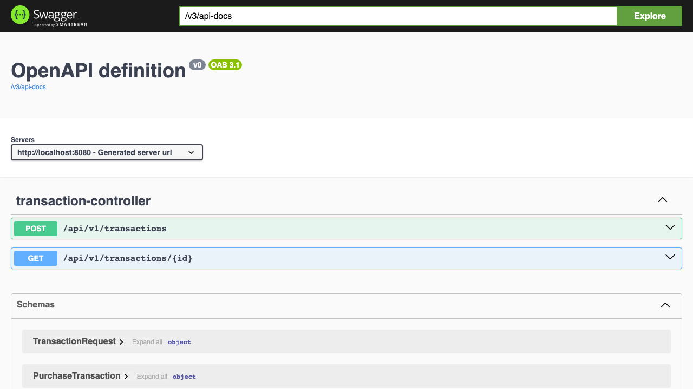
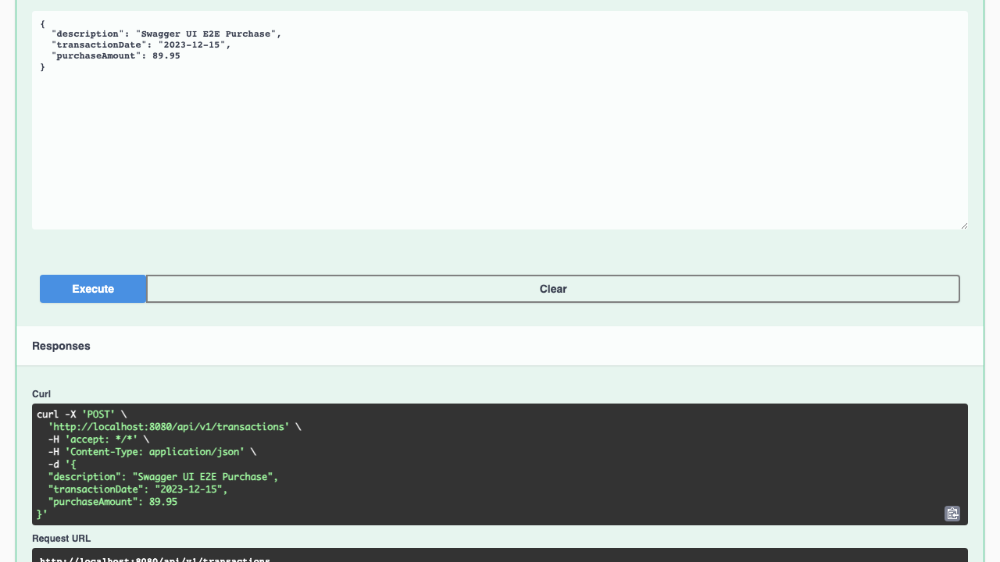
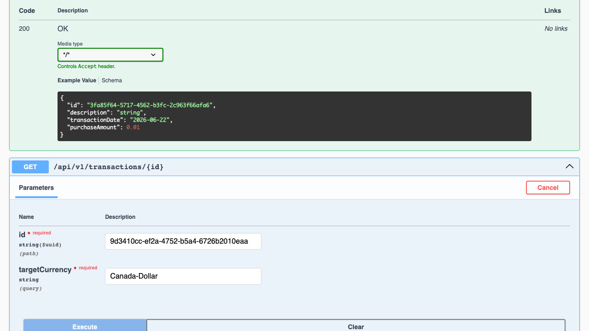

# E2E Test Suite Results Summary

This document presents the results, data, and details of the Playwright End-to-End (E2E) verification performed against the Transaction & Multi-Currency Conversion Service.

All configurations, tests, outputs, and visual logs are fully consolidated under the `e2e` directory.

---

## 📊 Summary Dashboard

| Metric | Value |
| :--- | :--- |
| **Total Test Cases** | 8 |
| **Passed** | 8 |
| **Failed** | 0 |
| **Execution Time** | ~2.7 seconds |
| **Target URL** | `http://localhost:8080` |
| **Interactive Docs** | `http://localhost:8080/swagger-ui/index.html` |

---

## 🧪 Test Case Coverage Details

### 1. Direct API Tests
Exercises the core HTTP boundaries of the system to ensure field validation rules and conversion calculations strictly comply with the requirements.

* **POST /api/v1/transactions (Success)**
  - Validates that a new purchase transaction is accepted and correctly stored, generating a unique UUID.
* **GET /api/v1/transactions/{id} (Success)**
  - Verifies multi-currency conversion against the US Treasury API for a valid transaction. Validates mathematical rounding to exactly 2 decimal places using HSL H2 data rates.
* **GET /api/v1/transactions/{id} (404 Not Found)**
  - Asserts that searching for a non-existent UUID returns a `404 Not Found` with the correct error message.
* **GET /api/v1/transactions/{id} (400 Threshold Failure)**
  - Asserts that a transaction with a historical date where no exchange rates exist within the preceding 6 months returns a `400 Bad Request` containing the exception:
    `"No currency conversion rate is available within 6 months equal to or before the purchase date."`
* **POST /api/v1/transactions (400 Validation Failures)**
  - Description exceeds 50 characters limits.
  - Purchase amount is less than the minimum `0.01` threshold.
  - Required fields (e.g. description) are missing.

### 2. Swagger UI Interactive Playground Tests
Automates real user interaction through Chromium on the Swagger UI page to verify that developer testing and API documentation features operate seamlessly in a live environment.

* **Swagger UI Landing Page Verification**
  - Confirms the title is correct and the page loads all elements.
* **POST Request Execution**
  - Clicks "Try it out", fills the text area, executes the POST, and extracts the UUID from the response body.
* **GET Conversion Execution**
  - Clicks "Try it out", fills path and query parameters, executes the GET, and verifies that the output correctly updates and performs the conversion.

---

## 🗄️ Test Data Matrix

Below is the specific data sets used for each verification run:

| Test Name | Description | Transaction Date | Purchase Amount | Target Currency | Expected Status |
| :--- | :--- | :---: | :---: | :---: | :---: |
| POST Success | "Mechanical Keyboard purchase" | 2023-12-15 | $129.99 | - | `201 Created` |
| GET Conversion | "Canada-Dollar Conversion Test" | 2023-12-15 | $100.00 | Canada-Dollar | `200 OK` |
| GET 404 Error | - | - | - | Canada-Dollar | `404 Not Found` |
| GET 400 Old Date | "Old Transaction" | 2000-01-01 | $50.00 | Canada-Dollar | `400 Bad Request` |
| POST Val Desc | "A".repeat(51) | 2023-12-15 | $10.00 | - | `400 Bad Request` |
| POST Val Amount | "Invalid Amount Test" | 2023-12-15 | $0.00 | - | `400 Bad Request` |
| POST Val Missing | (Missing Description) | 2023-12-15 | $10.00 | - | `400 Bad Request` |
| Swagger E2E POST | "Swagger UI E2E Purchase" | 2023-12-15 | $89.95 | - | `201 Created` |
| Swagger E2E GET | (Reused Swagger E2E POST UUID) | 2023-12-15 | $89.95 | Canada-Dollar | `200 OK` |

---

## 🎥 Visual Evidence & Artifacts

### Playwright HTML Report
The complete interactive HTML report is located at:
- [playwright-report/index.html](playwright-report/index.html)

### Screenshots

1. **Swagger UI Landing Page**
   

2. **Swagger UI POST Success**
   

3. **Swagger UI GET Conversion Success**
   

### Video Recording
The raw interactive test video run showing the browser automation is saved at:
- [swagger_e2e_video.webm](swagger_e2e_video.webm)
